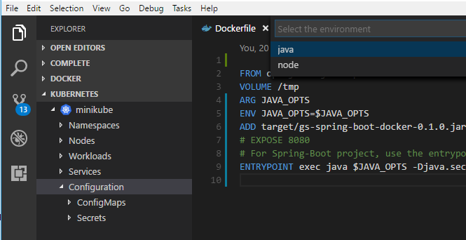
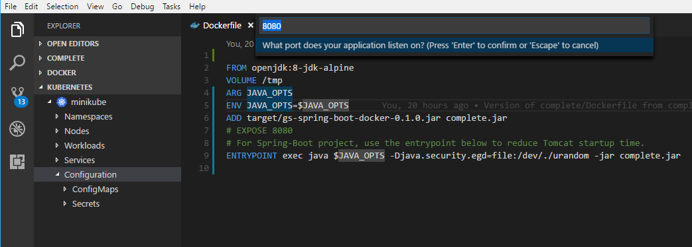
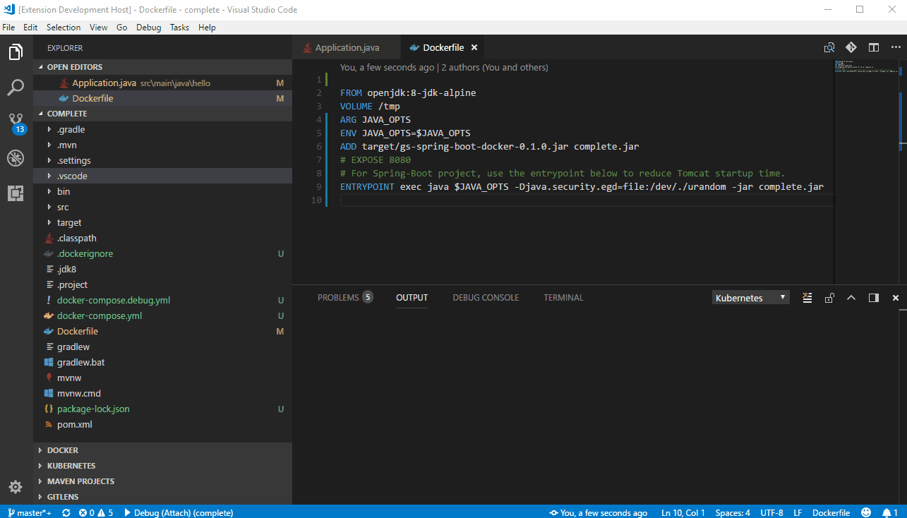
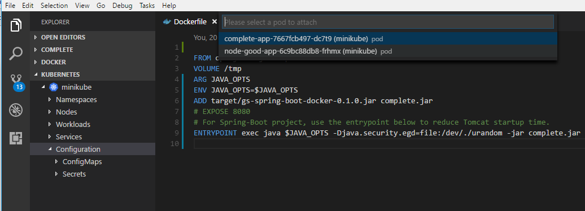
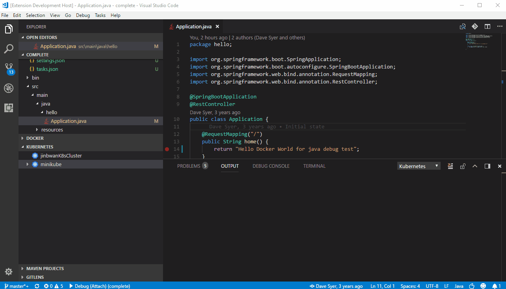

# Debug support on Kubernetes cluster

One of the key features of VS Code Kubernetes Extension is its one-click debugging support. This document shows you how to configure the feature and use it to debug your application.

## 1. Supported languages
   * `java` (Required: [Debugger for Java](https://marketplace.visualstudio.com/items?itemName=vscjava.vscode-java-debug) extension)
   * `node`

## 2. Commands for debugging
   * `Kubernetes: Debug (Launch)` - Run the current application as a Kubernetes Deployment and attach a debugging session to it (currently works only for Java/Node.js deployments)
   * `Kubernetes: Debug (Attach)` - Attach a debugging session to an existing Kubernetes Deployment (currently works only for Java deployments)

## 3. How to use it for Java debugging
### 3.1 Launch a Spring Boot application on Kubernetes and debug it
   * Launch VS Code.
   * Open a Spring Boot application.
   * If your application doesn't already have a Dockerfile, create one for it.
   * Install [Debugger for Java](https://marketplace.visualstudio.com/items?itemName=vscjava.vscode-java-debug) extension (if not already installed).
   * Set up the image repository on the VS Code user or workspace settings, using the `vsdocker.imageUser` configuration setting. (If debugging on minikube, skip this step.)
```javascript
  {
    ...
    "vsdocker.imageUser": "<your-image-prefix-here>",
    ...
  }
```
Where `<your-image-prefix-here>` is something like `docker.io/brendanburns` or `mycontainerregistry082.azurecr.io`.
   * Log into your repository using the appropriate tool. For example, to log into Docker Hub, run `docker login`; to log into Azure Container Registry, run `az acr login`. (If `vsdocker.imageUser` is not configured, skip this step.)
   * Run the VS Code command `"Kubernetes: Debug (Launch)"`.

The extension will try to automatically detect your application platform, but if this fails, you will have to select your debug environment manually.



After that, the extension will try to resolve the debug port and application port from the Dockerfile. Generally you could enable the debug port via the Java command line arguments `"-agentlib:jdwp=transport=dt_socket,server=y,suspend=n,address=5005,quiet=y"`, but if you don't specify it explicitly in your Dockerfile, the extension will inject this argument to an environment variable `JAVA_TOOL_OPTIONS` to help you enable the debug mode on Kubernetes container automatically. The application port is what your application provides service on. For Spring Boot, the typical application port is 8080 or 80. If you don't expose it explicitly in your Dockerfile, you will have to specify it manually.



When the prompts finish, the extension will start to build a Docker image from your current workspace, and run it as a deployment in Kubernetes and wait for the pod to be ready. After that, the extension creates port-forwarding for the ports (debug port and application port) to make them to be accessible at localhost. Finally, the extension starts a debug session to attach to the debug port.

Here is a GIF showing the full workflow:



### 3.2 Attach debugger to a running Kubernetes Java Deployment
   * Launch VS Code.
   * Open a Spring Boot application.
   * Install [Debugger for Java](https://marketplace.visualstudio.com/items?itemName=vscjava.vscode-java-debug) extension (if not already installed).
   * Run the VS Code command `"Kubernetes: Debug (Attach)"`.

You have to select the debug environment first. Then select the target pod that your application runs on. And if your pod contains multiple containers, you'll have to select the target container too. 



After that, the extension will try to resolve the debug port from the container's process list. If this fails, you'll have to specify it manually.

When the prompts finish, the extension will create port-forwarding for the debug port and attach a debug session to it.

Here is a GIF showing the full workflow:



To learn more about the features provided by the VS Code Kubernetes Extension, take a look at the [README](https://github.com/Azure/vscode-kubernetes-tools).
